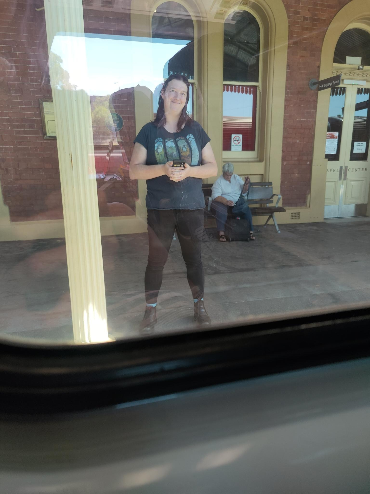

+++
title = "Vale David McGregor"
date = 2023-03-02T22:00:00+11:00
tags = ["hugo"]
[Params]
people = ["erica-baker", "fiona-baker"]
locations = ["Albury", "Wagga"]
transit_modes = ["XPT"]
+++

Today was massive. I think that it will take me quite some time to get over the events of today. I am overwhelmed to the point that it has taken me several days to expand this post from an outline to something that actually has paragraphs of text

### XPT back to Wagga

Eeby and I are so damn cute, we both sent photos of each others point pf view in the final minutes before the train left the Albury station. 

The train trip was a nice, run-of-the-mill train ride home! I got some more work on the Hugo-powerd journal, which I am now refering to as my 'asocial network', giving form to a long-standing joke of mine.

On arriving in Wagga, I managed to make it to Coles before the Lake Albert bus arrived outside the Sturt Mall. Given my limitations, I was quite proud of that effort.

## Communications

Communication was kinda off the chart! let's go through it:

### Temora Guy

So, a guy I was talking to on Grinder a year ago found me on FetLife, I wans't impressed with his empty profile and was considering just ignoring him until he mentioned our Grinder chat of old. We're to meet for coffee on Saturday morning as he is in town for a wedding.

### Wagga Guy

KanKook on Fet, I think is IRL name is Jay. We've spoken several times before, and I had reached out to him when someone I met at the recent Albury munch had asked if I knew him due to the Wagga connection. I'd be happy to meet up with him for play, since he's clearly known in the kink community.

### Ruby and Kelly

This was a pleasant surprise! Ruby reached out to me on behalf of Kelly from the last Wagga much asking for my Snapchat or phone number. As I have come to despise Snapchat, phone number was the way to go, we have exchanged a few messages, but as we were both inebriated, further chats have been postponed.

### Mum & Jenna

I called Mum, she happened to be in the car with Jenna, I verified Mum and Dad's birth years for Asocial and discussed staying a night at home with Eeby. Mum thinks it will be fine, but of course I have misgivings about exposing Dad to other trans people, especially those that I love. I'm sure she'll be laying down the law with him about us being welcome.

### Random and Devestating

s

Eeby, Jenna Again

### Facebook Chats

## Tech Stuff

### Hugo
I spend an inordinate ammount of time on the XPT trying to figure out why Hugo wouldn't display a new post I made by copying a previous post's markdown file to a new location and editing from there. My first thought was that Hugo really wanted me to use the 'hugo new' command, but alas, this was not the issue. I was dating my posts for 10pm of the day of writing, a date set in the future! Hugo was just being well-behaved and not publishing my post before it was due to be posted!

## Eeby & Fiona

Damn I miss that girl, it hasn't even been an hour. tsince I left. Our relationship has progressed so damn quickly, it's both surprising and immensly satisfying.
I also adore Fiona and am so pleased that she likes me, and especially asks me to come back. It adoreable, and validating! I'm not a burden to my metamour!

## Francine

Francine continues to be manic.  

## David McGregor

This is seriously fucked up. David is dead.
I just got a message from a facebook random asking me if I was friends with David. Turns out she is his sister-in-law and that he has been found dead, sitting up in his bed at the accomodation for his fly-in, fly-out chef gig for railway workers out in Mudgee,