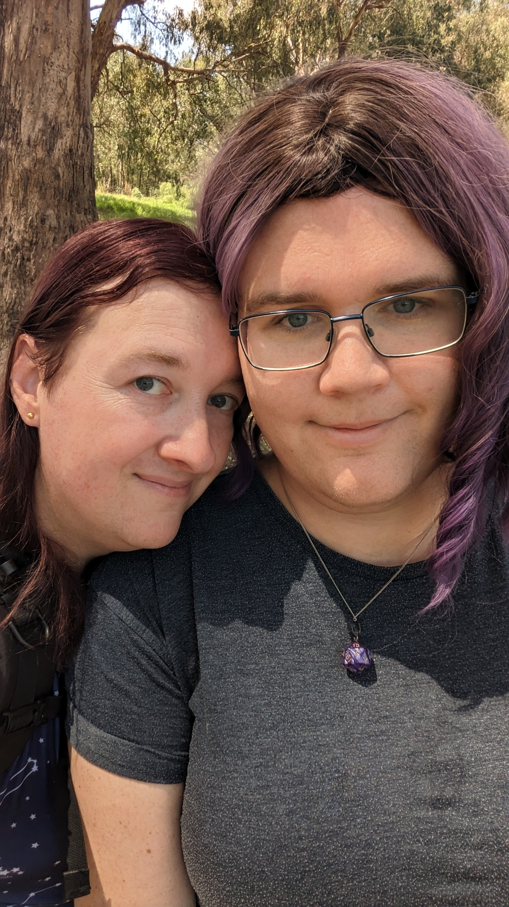

+++
title = "Bushwalk with Eeby"
date = 2023-03-01T22:00:00+11:00
tags = ['hugo', 'photos', 'pain']
[Params]
people = ['erica-baker', 'francine-james']
locations = ['albury']
+++
I'm in Albury today, an overcast morning that cleared up by midday. [Eeby](/people/erica-baker) and I went for a walk along the Yindyamarra Sculpture Walk.

## Hugo
In a very meta piece of commentary, I've gone and set up a Hugo in stance for journaling. I do wonder whether or not this will be a persistent part of my life going forward. We shall see.

I'm finding figuring out how to handle pictures to be incredibly frustrating, but I'll get there eventually. For now I'm just using markdown and CSS to display pictures at a reasonable size on-screen, but it's terribly inefficient, having Hugo handle generating suitable thumbnails and image sizes would be ideal.
## Cursed Biology
Oh yes, it seems to be that time of the month! Emotions and intestinal distress are very yes.
## Francine
She broke up with Anna and I (i.e. all of her relationships) not long ago, and by text message of all media! Quite disappointing, but not a difficult loss after she continued to date Traverse after he assaulted me. That was drama I didn't need and I wish I had pulled the plug on my relationship with Francine then.

Francine is still manic.

Apparently she is out of hospital, but was claiming to have written a song for me, which turned out to be A Perfect Circle's 'The Doomed'. She then told me that she wanted to take me to heaven and that I should feel like Neo from The Matrix. Wow. Just wow.