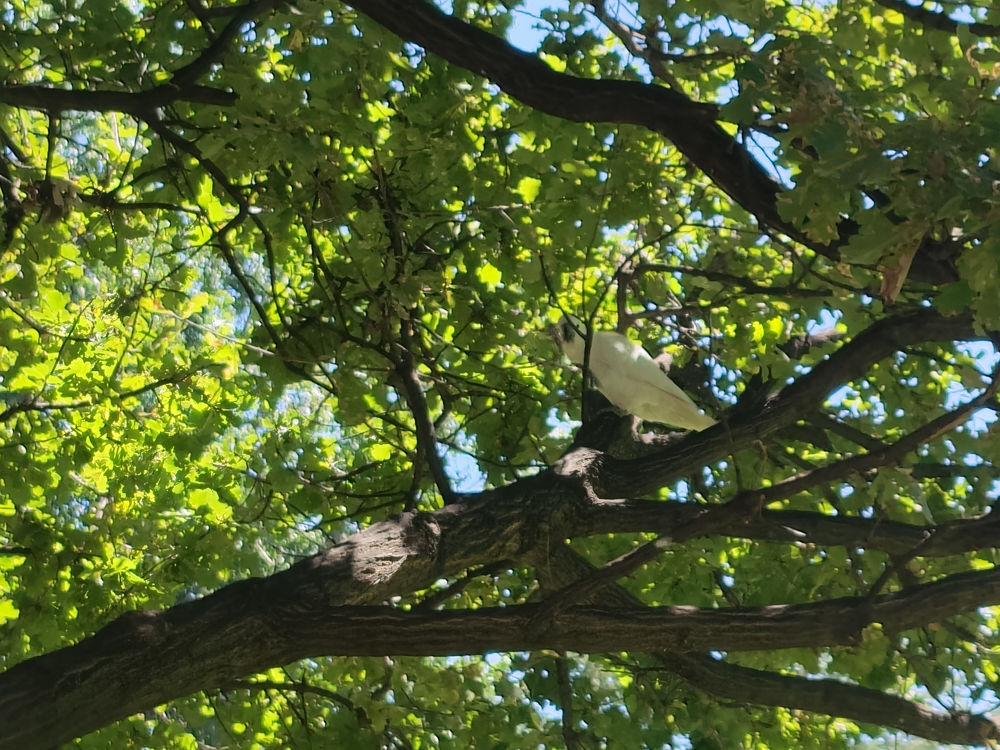

+++
title = "Library Hacking, the Sequel!"
date = 2023-03-07T22:00:00+11:00
tags = ["health", "coding", "writing", "socialising", "kink"]
[Params]
people = ['narelle-weymouth', 'erica-baker', 'reanna-harris', 'naveen-pratt', 'ruby-mabley']
locations = ["Wagga"]
+++
Today was incredibly productive, regardless of foot pain from far too much walking and delays from others.
## Podiatry
I had a quick appointment with Ben at the High Risk Foot Clinic, mainly to look at my old shoes and custom insoles. The insoles were fine, and we agreed to go with a safe but asthetically orthotic shoe, which led me to call in at Active Foot Clinic while walking back to Baylis St. We selected a shoe (one that Ben had shown me online, a $269 dollar pair of Doctor Comforts) and tried it on in size 11 wide, and determined with Maria, a podiatrist who's reputation had preceded our meeting today, that a size 11.5 wide would be ideal. They are ordering it in, and getting in touch with a shoe company that visits every month or so with access to a wider range of shoes. This safe pair, a pair for hiking and a nice pair will be sufficient

Unfortunately, I was misgendered repeatedly by both the receptionist and Maria, even after asking them to use my preferred pronouns and despite my appearance - wig, boobs, red dress, handbag... ugh. People are a problem.
## Mum
I let mum know about the above, and that Marathon Health is looking for a way to fund them for me. She is happy to pay but we will wait to see if Marathon Health can deliver or not. More likely not.

We also finalised plans for Eeby and I staying over Friday night.
## Library Hacking & Writing
And so I found myself at the Library, hacking and writing just like on Saturday. I like working in spaces I don't own or have distractions in.

I took an hour's break in the Victory Memorial Gardens, with some cockatoo friends perched above me:

Afterwards I returned for several more hours of nerdery until...
## Reanna Harris
Reanna finally turned up around 5pm, with the money she owed me, a hug and about an hour of catching up. I'm glad she prooved herself reliable and I look forward to meeting up with her again. She is keen for her partner to meet me.
## Home
I god home, chatted with Eeby, became admin of the Wagga FetLife group and joked about such with Eeby, Navi, Ruby and Merideth. Good times, but Journals must be written, clothes must be washed and sleep must be had.